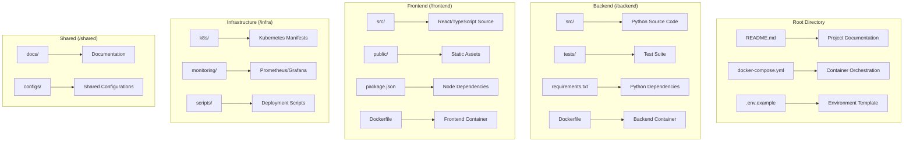

# Design Document

## Overview

This design outlines the comprehensive cleanup and enhancement of the Kubernetes monitoring, RAG, and dashboard system. The current project has evolved organically and contains duplicate files, inconsistent structure, and multiple virtual environments. The design focuses on creating a clean, maintainable, and production-ready system with clear separation of concerns.

## Architecture

### Current Issues Identified

1. **Duplicate Files**: Multiple README files (README.md, README1.md), duplicate requirements files
2. **Inconsistent Structure**: Mixed frontend/backend files, scattered configuration
3. **Multiple Virtual Environments**: `.venv`, `venv_rag`, and root-level virtual environments
4. **Scattered Dependencies**: Multiple requirements files with overlapping dependencies
5. **Build Artifacts**: Committed `__pycache__`, log files, and other generated content
6. **Mixed Responsibilities**: Frontend and backend code intermingled

### Target Architecture



## Components and Interfaces

### 1. Directory Structure Reorganization

**Target Structure:**

```
├── README.md                    # Main project documentation
├── docker-compose.yml           # Local development setup
├── .env.example                 # Environment template
├── .gitignore                   # Comprehensive ignore rules
├── backend/                     # Python backend services
│   ├── src/
│   │   ├── agents/              # Multi-agent system
│   │   ├── api/                 # FastAPI endpoints
│   │   ├── models/              # ML models
│   │   ├── services/            # Business logic
│   │   └── utils/               # Shared utilities
│   ├── tests/                   # Backend tests
│   ├── requirements.txt         # Consolidated dependencies
│   ├── Dockerfile               # Backend container
│   └── pyproject.toml           # Python project config
├── frontend/                    # React frontend
│   ├── src/
│   │   ├── components/          # React components
│   │   ├── pages/               # Next.js pages
│   │   ├── hooks/               # Custom hooks
│   │   ├── services/            # API clients
│   │   └── utils/               # Frontend utilities
│   ├── public/                  # Static assets
│   ├── package.json             # Node dependencies
│   ├── Dockerfile               # Frontend container
│   └── next.config.js           # Next.js config
├── infra/                       # Infrastructure code
│   ├── k8s/                     # Kubernetes manifests
│   ├── monitoring/              # Prometheus/Grafana
│   └── scripts/                 # Deployment scripts
└── shared/
    ├── docs/                    # Additional documentation
    └── configs/                 # Shared configurations
```

### 2. Dependency Consolidation

**Backend Dependencies Strategy:**

- Consolidate all Python requirements into single `backend/requirements.txt`
- Use `pyproject.toml` for modern Python project management
- Pin versions for production stability
- Separate dev dependencies from production

**Frontend Dependencies Strategy:**

- Single `package.json` in frontend directory
- Use workspace configuration if needed for shared components
- Optimize bundle size and remove unused dependencies

### 3. Configuration Management

**Environment Variables:**

- Single `.env.example` template at root
- Environment-specific overrides in deployment
- Secure handling of API keys and secrets

**Configuration Files:**

- Centralized configuration in `shared/configs/`
- Environment-specific configurations
- Validation of required configurations on startup

### 4. Build and Deployment

**Containerization:**

- Separate Dockerfiles for frontend and backend
- Multi-stage builds for optimization
- Docker Compose for local development

**CI/CD Pipeline:**

- Automated testing and linting
- Security scanning for dependencies
- Automated deployment to staging/production

## Data Models

### Configuration Schema

```typescript
interface AppConfig {
  database: {
    chromaUrl: string;
    persistDirectory: string;
  };
  llm: {
    provider: "nvidia" | "llama" | "openai";
    apiKey: string;
    apiUrl?: string;
    model: string;
  };
  kubernetes: {
    configPath?: string;
    namespace: string;
    prometheusUrl?: string;
  };
  monitoring: {
    metricsInterval: number;
    alertThreshold: number;
    logLevel: "debug" | "info" | "warn" | "error";
  };
}
```

### File Cleanup Schema

```typescript
interface CleanupPlan {
  filesToRemove: string[];
  filesToMove: Array<{
    from: string;
    to: string;
  }>;
  directoriesToCreate: string[];
  directoriesToRemove: string[];
}
```

## Error Handling

### File Operations

- Backup critical files before moving/deleting
- Rollback mechanism for failed operations
- Validation of file dependencies before removal

### Dependency Management

- Version conflict detection and resolution
- Graceful handling of missing dependencies
- Clear error messages for configuration issues

### Migration Safety

- Step-by-step migration with checkpoints
- Validation at each step
- Ability to pause and resume migration

## Testing Strategy

### Pre-Migration Testing

- Inventory all current functionality
- Create test cases for critical paths
- Document expected behavior

### Post-Migration Testing

- Automated tests for all moved components
- Integration tests for API endpoints
- End-to-end tests for user workflows

### Regression Testing

- Compare functionality before and after
- Performance benchmarking
- Security vulnerability scanning

## Implementation Phases

### Phase 1: Analysis and Planning

- Complete inventory of current files and dependencies
- Identify all duplicate and obsolete files
- Create detailed migration plan with rollback procedures

### Phase 2: Dependency Consolidation

- Merge and deduplicate requirements files
- Update package versions to latest stable
- Test compatibility of consolidated dependencies

### Phase 3: Structure Reorganization

- Create new directory structure
- Move files to appropriate locations
- Update import paths and references

### Phase 4: Configuration Cleanup

- Consolidate configuration files
- Implement environment variable management
- Update documentation and setup procedures

### Phase 5: Build System Enhancement

- Create optimized Dockerfiles
- Set up Docker Compose for development
- Implement proper .gitignore rules

### Phase 6: Documentation and Validation

- Update all documentation
- Create setup and deployment guides
- Perform comprehensive testing

## Security Considerations

### Secrets Management

- Remove any hardcoded API keys or passwords
- Implement proper environment variable handling
- Use secure defaults for all configurations

### Dependency Security

- Scan for known vulnerabilities
- Update to secure versions
- Implement dependency monitoring

### Container Security

- Use minimal base images
- Run containers as non-root users
- Implement proper security contexts

## Performance Optimizations

### Build Performance

- Multi-stage Docker builds
- Efficient layer caching
- Parallel build processes where possible

### Runtime Performance

- Optimized dependency loading
- Efficient resource utilization
- Proper logging levels for production

### Development Experience

- Fast development server startup
- Hot reloading for both frontend and backend
- Clear error messages and debugging information
